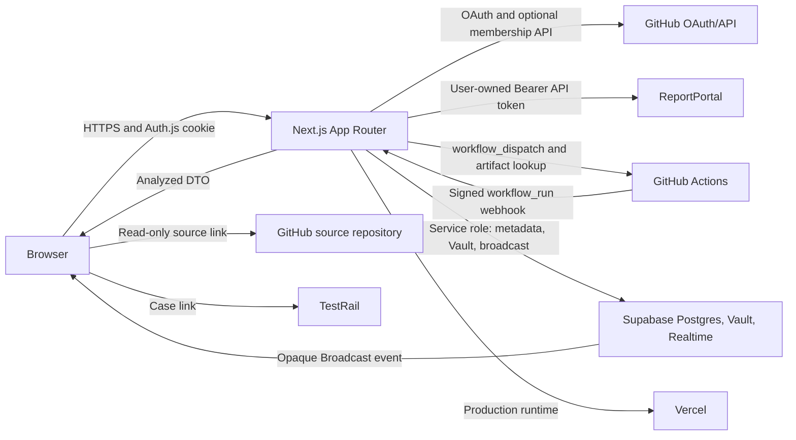
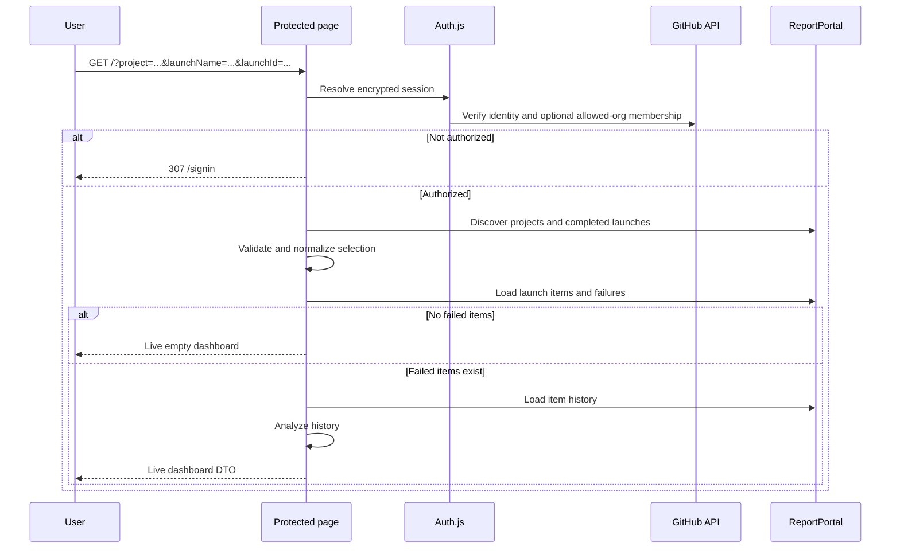
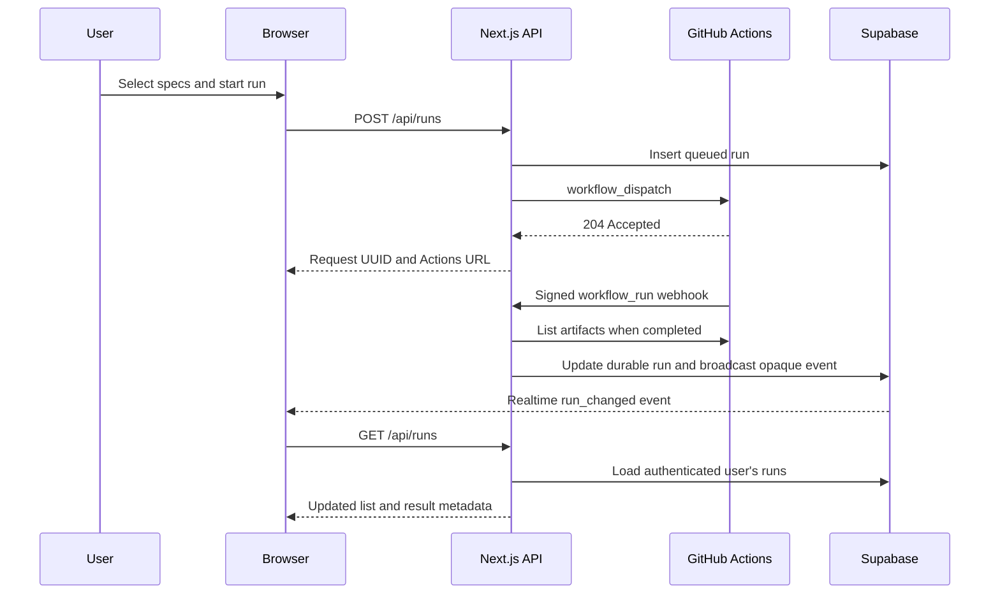

# Failure Intelligence Engineering Guide

## Purpose

Failure Intelligence is an authenticated, read-only analytics application for investigating failed automated tests stored in ReportPortal. It helps an authorized user select a ReportPortal project, launch name, specific completed run, team, and history depth; inspect failure patterns; and open the corresponding Cypress source, ReportPortal log, or TestRail case.

ReportPortal is the source of truth for failure data and analytics. Supabase persists Cypress workflow metadata and user-owned configuration; secret values use Supabase Vault authenticated encryption. The application contains no bundled report or fallback test data.

## Product Boundaries

The application:

- Reads projects, launches, test items, and item history from ReportPortal.
- Calculates failure metrics and risk categories in memory for each request.
- Authenticates users with GitHub OAuth and restricts access by active organization membership or a static GitHub-login allowlist.
- Creates read-only links to a configured GitHub source repository.
- Optionally creates TestRail links from test case identifiers.
- Dispatches explicitly selected Cypress specs to a bounded GitHub Actions workflow.
- Tracks dispatched workflow status, conclusion, duration, and artifact availability through signed GitHub webhooks, Supabase, and the GitHub Actions artifact API.
- Deploys as a Next.js application on Vercel.

The application does not:

- Run Cypress tests inside the dashboard or Vercel runtime.
- Modify the configured source repository.
- Store ReportPortal reports or OAuth tokens in Supabase, or store API/test credentials outside Vault.
- Show bundled, synthetic, cached, or cross-launch fallback report data.
- Allow unauthenticated local development access.

## Primary Use Cases

### Investigate a failed launch

1. Sign in with GitHub.
2. Select an accessible ReportPortal project.
3. Select a completed launch name.
4. Keep the latest completed run selected or choose a historical run. Historical selections display a warning.
5. Enter the team filter and choose a history depth.
6. Review current failures, historical failure rate, streaks, transitions, and risk categories.
7. Open the source spec, ReportPortal log, or TestRail case.

### Share a report selection

The project, launch name, launch ID, team, and history depth are encoded as validated URL query parameters. An authorized colleague can open the URL and reproduce the exact run selection. Authentication is still required.

### Handle an empty result

A valid ReportPortal response with no matching tests or failures is not an error. Metrics remain zero and the grid displays `No data`.

### Handle an integration failure

A ReportPortal transport or API failure produces no report rows. The UI displays an error toast and marks the source as a load error. It never substitutes another project, team, or launch.

## System Architecture



### Runtime layers

| Layer | Ownership | Responsibilities |
| --- | --- | --- |
| `src/app` | Routing and server composition | Authentication boundary, query validation, redirects, Auth.js endpoints, page metadata |
| `src/auth.ts` | Identity and authorization | GitHub OAuth, mode-specific authorization, JWT/session shaping |
| `src/lib/config.ts` | Configuration boundary | Server-side environment validation and normalized configuration |
| `src/lib/reportportal.ts` | Integration boundary | Paginated ReportPortal discovery, launch resolution, item/history loading, explicit empty/error outcomes |
| `src/lib/pagination.ts` | Pagination utility | Ordered, bounded-concurrency traversal of every page returned by ReportPortal |
| `src/lib/cypress-runs.ts` | Execution boundary | Authenticated GitHub Actions workflow dispatch and completed-run artifact discovery |
| `src/lib/cypress-run-store.ts` | Persistence boundary | Service-role run storage, user-scoped listing, updates, HMAC channel names, and Broadcast publishing |
| `src/lib/cypress-run-request.ts` | Validation boundary | Selected spec paths and bounded runner settings |
| `src/lib/user-settings.ts` | Secret/configuration boundary | Owner-scoped metadata, Supabase Vault operations, profiles, and one-time run snapshots |
| `src/lib/user-settings-schema.ts` | Validation boundary | HTTPS-only integration settings and supported Cypress profile fields |
| `src/lib/analytics.ts` | Domain logic | Convert ReportPortal history into rows, trends, metrics, and risk categories |
| `src/lib/types.ts` | Internal contracts | Dashboard DTOs, ReportPortal response shapes, report selection types |
| `src/components/Dashboard.tsx` | Client UI | Selectors, filters, DataGrid, links, metrics, empty states, and error toasts |
| `src/components/RunsView.tsx` | Client UI | Durable run list, Realtime subscription, result links, and completion toasts |
| `src/components/SettingsView.tsx` | Client UI | Secret write-only settings and named Cypress profile management |
| `src/components/AppHeader.tsx` | Shared navigation | Analysis/runs navigation, refresh, source state, and sign-out controls |
| `src/app/api/report-source/route.ts` | Authenticated selection API | Dependent launch-name and run discovery for the selected ReportPortal project |
| `src/app/api/runs/route.ts` | Authenticated run API | User-scoped run listing and validated workflow dispatch |
| `src/app/api/webhooks/github/route.ts` | Webhook boundary | HMAC, repository, workflow, and request-ID validation; run updates and broadcasts |
| `supabase/migrations` | Database schema | Run metadata, owner-scoped settings, Vault references, one-time profile claims, constraints, and RLS |
| `src/types` | Framework augmentation | Auth.js session and JWT type extensions |

### Request flow



### Cypress execution status flow



The workflow `run-name` embeds the server-generated request UUID. The webhook validates `X-Hub-Signature-256`, repository, workflow path, and UUID before updating an existing row. The `cypress_runs` table has RLS enabled with no browser policies, so only server routes using the service role can read or mutate rows. New run ownership and authenticated list requests use the immutable GitHub provider account ID.

Realtime uses a public Supabase Broadcast channel whose name is an HMAC of the immutable owner key and `AUTH_SECRET`. Events contain only the opaque request UUID. Receiving an event authorizes nothing; it tells the browser to make one normal authenticated `/api/runs` request. This avoids polling while keeping run data behind Auth.js authorization.

The Analysis page owns failure selection and workflow dispatch. The authenticated `/runs` page owns run history and Realtime status updates, keeping test execution monitoring separate from ReportPortal analysis.

`listCypressRuns()` returns the 20 newest rows for the authenticated GitHub login. Rows remain durable beyond that display window. The app does not poll GitHub or Supabase on a timer.

## Authentication and Authorization

Authentication is mandatory in every environment, including local development.

1. Auth.js redirects the user to GitHub OAuth with identity scopes; `read:org` is added only in organization mode.
2. `AUTHORIZATION_MODE` selects `organization` or `users`; configuration validation requires a non-empty allowlist for the selected mode.
3. In `organization` mode, GitHub must report `state: active` for the user in an organization in `AUTH_ALLOWED_ORGS`. The app requests `read:org`, retains the token only in the encrypted HTTP-only JWT, and revalidates membership on protected requests.
4. In `users` mode, the authenticated GitHub login must match an entry in `AUTH_ALLOWED_USERS`, case-insensitively. The app does not request `read:org` or retain the OAuth access token.
5. Every protected request revalidates the current identity against the active mode and deployment configuration.
6. The browser-visible session contains display identity and a non-secret authorization context, but never the GitHub access token.

There is no local bypass flag. Missing OAuth configuration fails application configuration validation.

### Local OAuth configuration

The default development origin is `http://localhost:8080`.

Create a GitHub OAuth App with:

- Homepage URL: `http://localhost:8080`
- Authorization callback URL: `http://localhost:8080/api/auth/callback/github`

Use `localhost`, not `127.0.0.1`, because GitHub callback URLs must match exactly. Never commit the OAuth client secret or Auth.js secret.

## Data Model and Analytics

### Selection

A report selection contains:

- `project`: ReportPortal project name.
- `launchName`: exact completed launch name.
- `launchId`: exact completed run ID. When omitted or invalid for the launch name, the latest completed run is selected and the URL is canonicalized.
- `team`: substring used to filter ReportPortal item names.
- `historyDepth`: number of historical launches, constrained to 1 through 30 by the ReportPortal API.

Projects, launch names, and completed runs are discovered server-side. Changing project or launch name defaults to its latest completed run. Selecting an older run preserves its ID in the URL and displays a warning that the analysis is historical.

The report-source form loads its choices as a dependent `Project → Launch name → Run` chain. A changed parent disables affected child controls while the authenticated selection API loads their options. Starting another parent change aborts the stale browser request; the visible Cancel action aborts the active request and restores the last settled selection. The report itself is not replaced until the user applies a complete selection.

ReportPortal discovery, test-item, failure, and history requests traverse every advertised API page with bounded concurrency. The browser receives the complete analyzed row set; Data Grid sorting and filtering run client-side across all matching rows before UI pagination.

### Metrics

The dashboard currently calculates:

- Current suite failure rate.
- Number of failed test identities and unique Cypress specs.
- Historical cohort failure percentage.
- Immediate regressions, where the current failure follows a passed execution.
- Current failure streak and status transitions per test.
- Risk distribution.

Risk categories are derived from returned history:

- `Persistent`: failed in every returned execution.
- `High risk`: at least eight failed executions, but not every execution.
- `Isolated`: exactly one failed execution.
- `Intermittent`: any remaining failure pattern.

These categories are application analytics, not ReportPortal defect types.

### Source links

The GitHub source URL is assembled from deployment-fixed owner, repository, and ref plus the ReportPortal `codeRef`-derived Cypress path. Browser input cannot choose a repository or ref. The integration is link-only and has no GitHub repository token or write operation.

## Error and Empty-State Contract

Keep these outcomes distinct:

| Outcome | `meta.source` | Rows | User feedback |
| --- | --- | --- | --- |
| Successful data | `live` | Returned failures | Live data indicator |
| Successful empty response | `live` | Empty | `No data` in the grid |
| API/configuration failure | `error` | Empty | Error toast and load-error indicator |

Do not catch an integration failure and return data from another selection. Do not add fixtures to production loader paths. Test fixtures, when introduced, must remain isolated to tests.

## Configuration

All secrets are server-only. No secret may use a `NEXT_PUBLIC_` prefix.

| Variable | Required | Secret | Purpose |
| --- | --- | --- | --- |
| `APP_NAME` | No | No | Display name |
| `AUTH_SECRET` | Yes | Yes | Auth.js JWT/cookie encryption |
| `AUTH_GITHUB_ID` | Yes | No | GitHub OAuth client ID |
| `AUTH_GITHUB_SECRET` | Yes | Yes | GitHub OAuth client secret |
| `AUTHORIZATION_MODE` | No | No | `organization` (default) or `users` |
| `AUTH_ALLOWED_ORGS` | In organization mode | No | Comma-separated GitHub organization allowlist |
| `AUTH_ALLOWED_USERS` | In users mode | No | Comma-separated GitHub-login allowlist |
| `GITHUB_ACTIONS_TOKEN` | For Cypress dispatch | Yes | Fine-grained token with Actions write access to the dashboard repository |
| `GITHUB_ACTIONS_OWNER` | No | No | Workflow repository owner |
| `GITHUB_ACTIONS_REPO` | No | No | Workflow repository name |
| `GITHUB_ACTIONS_WORKFLOW` | No | No | Selected-spec workflow filename |
| `GITHUB_ACTIONS_REF` | No | No | Workflow ref |
| `GITHUB_WEBHOOK_SECRET` | For run updates | Yes | Verifies GitHub `workflow_run` HMAC signatures |
| `NEXT_PUBLIC_SUPABASE_URL` | With run tracking | No | Supabase project URL; required with the other two Supabase values |
| `NEXT_PUBLIC_SUPABASE_ANON_KEY` | With run tracking | No | Public key used only for opaque Broadcast subscriptions; required with the other two Supabase values |
| `SUPABASE_SERVICE_ROLE_KEY` | With run tracking | Yes | Server-only database and broadcast access; required with the other two Supabase values |
| `AUTH_TRUST_HOST` | Deployment-dependent | No | Auth.js trusted-host behavior |
| `GITHUB_SOURCE_OWNER` | Yes | No | Source link repository owner |
| `GITHUB_SOURCE_REPO` | Yes | No | Source link repository name |
| `GITHUB_SOURCE_REF` | Yes | No | Fixed source link branch, tag, or SHA |

Some legacy integration variables may remain in local environments, but application code must not imply support unless the variable is validated and consumed by `src/lib/config.ts`.

The three Supabase values are optional only as a group: if any one is present, configuration validation requires all three. Settings, `/runs`, and dispatch require the group. ReportPortal/TestRail values and Cypress profiles are user configuration, not deployment variables.

### User configuration security

- Auth.js records the immutable GitHub provider account ID in the encrypted JWT; it becomes the owner key for settings and profiles. Sessions created before this feature must sign in again.
- Browser roles receive no policies or grants for settings, profiles, run snapshots, or Vault. All access passes through authenticated Next.js routes using the service role and an explicit owner filter.
- Supabase Vault encrypts secret JSON with authenticated encryption and keeps its project root key separate from database data and backups.
- GET responses return editable non-secret fields and `has...` flags only. Stored API keys and passwords are never returned.
- User-provided ReportPortal, TestRail, FOLIO, Okapi/Kong, and Edge endpoints must use HTTPS.
- A Cypress dispatch copies the selected profile into a one-hour Vault secret. An atomic SQL consume operation returns the snapshot once while deleting its row and Vault value in the same transaction. Supabase Cron purges expired unclaimed snapshots and Vault values every 15 minutes.
- The workflow presents a short-lived GitHub Actions OIDC token. The server verifies its signature, issuer, audience, repository, owner, workflow ref, branch, dispatch event, and GitHub-hosted runner before releasing a snapshot. No reusable profile-delivery secret is stored.
- The workflow retains a one-release fallback reference to `DASHBOARD_PROFILE_ACCESS_TOKEN` solely so the new workflow can coexist with the previous dashboard during deployment. Delete that GitHub secret after the first successful OIDC-authenticated run to deactivate the fallback.
- After the OIDC cutover, remove obsolete shared GitHub/Vercel profile and integration values. User-owned Vault settings are the only supported ReportPortal, TestRail, and Cypress configuration source.
- Retrieved Cypress passwords and API keys are registered with GitHub's log masker before tests start. Credential files use mode `0600`, are excluded from artifacts, and are removed by an `always()` cleanup step.

## Local Development

Requirements:

- A supported Node.js version for Next.js 16.
- Corepack and pnpm 10.15.1.
- A local GitHub OAuth App configured for port 8080.
- Membership in an allowed organization or a login in the configured static-user allowlist.
- Supabase migrations applied; each user configures ReportPortal and Cypress profiles after sign-in.
- Supabase configuration, a GitHub Actions token, and a webhook secret when developing Cypress dispatch and run tracking.

```bash
corepack enable
pnpm install
cp .env.example .env.local
pnpm exec auth secret
pnpm dev
```

Open `http://localhost:8080`. The package script owns the default host and port:

```json
"dev": "next dev --hostname localhost --port 8080"
```

Override the script explicitly only for a deliberate alternate OAuth App configuration. The OAuth callback must use the same origin as the running app.

## Code Guidelines

### General

- Use TypeScript and preserve strict internal contracts.
- Keep server credentials and third-party API calls in server-only modules.
- Validate all URL and environment input with Zod at a server boundary and require HTTPS for credential-bearing integrations.
- Prefer small, explicit functions over speculative abstractions.
- Keep changes scoped to the owning layer.
- Do not add repository mutation or test-execution behavior without an explicit architecture decision.
- Use pnpm exclusively for this application.

### Next.js and React

- Read the versioned Next.js documentation in `node_modules/next/dist/docs/` before relying on framework behavior.
- Prefer Server Components for authentication, integration calls, and initial data loading.
- Add `"use client"` only where browser state or interactions require it.
- Keep protected data access behind `getAuthorizedSession()`; hiding controls in the browser is not authorization.
- Preserve URL-backed report selection so reports remain reproducible and shareable.
- Avoid exposing server error internals beyond actionable, non-secret messages.

### ReportPortal integration

- Add endpoints through the server-only ReportPortal client.
- Use structured URL/query APIs rather than string concatenation.
- Treat non-2xx responses as errors and retain endpoint/status context.
- Distinguish an empty successful response from a failed request.
- Fetch history only when current failed items exist.
- Treat the current failed-item response as the failure-row source of truth. Enrich it with matching history, and retain unmatched current failures as one-run rows because ReportPortal history can be incomplete.
- Never substitute fixture or previous-launch data after a live failure.
- Consider pagination whenever an endpoint can exceed its requested page size.

### UI

- Follow the established MUI theme and compact operational layout.
- Use selectors for finite server-discovered choices.
- Use toasts for integration failures and `No data` for valid empty results.
- Keep source, ReportPortal, and TestRail links visibly distinct and read-only.
- Ensure controls and DataGrid remain usable on mobile and desktop widths.

### Security

- Never log, serialize, or expose OAuth, ReportPortal, GitHub Actions, webhook, or Supabase service-role secrets.
- Never route credentials through client props or browser storage.
- Validate selected specs as repository-relative Cypress paths and bound spec count, repetitions, threads, browser, and timeout before dispatch.
- Resolve Cypress profile IDs only within the authenticated immutable owner key. Keep profile contents in Supabase Vault and out of workflow inputs.
- Restrict UI-provided Cypress configuration to the bounded non-secret allowlist in `cypress-run-request.ts`; validate it again inside the workflow.
- Keep `GITHUB_ACTIONS_TOKEN` server-only. Authenticate Cypress profile retrieval with the narrowly validated GitHub Actions OIDC identity.
- Keep `SUPABASE_SERVICE_ROLE_KEY` and `GITHUB_WEBHOOK_SECRET` server-only. Do not add browser table policies for `cypress_runs`.
- Keep GitHub source repository configuration server-controlled.
- Maintain fail-closed authorization when the selected organization or user authorization rule cannot be verified.
- Do not add an authentication bypass for development or tests.
- Use isolated test doubles at test boundaries when authentication needs automation.

## Validation and Testing

Run the complete repository check before merging:

```bash
pnpm check
```

It currently runs 21 Vitest tests in four files, ESLint, legacy script syntax checks, and a production Next.js build.

For behavior changes, also validate the smallest relevant path:

- Authentication: unauthenticated `/` redirects to `/signin`; OAuth uses the 8080 callback; logins outside the active mode's allowlist are rejected.
- Report selection: changing project or launch name refreshes completed run choices and canonicalizes to the latest run; selecting an older run preserves its launch ID and displays a warning.
- Live data: failures produce rows and metrics from the selected launch/team only.
- Empty data: a valid empty response shows `No data` and no error toast.
- Error data: an API failure shows an error toast and no rows.
- Source links: generated URLs use the configured owner, repository, and ref.
- Cypress request validation: duplicate specs are deduplicated and all counts, paths, browsers, and timeouts remain within server and workflow bounds.
- Cypress configuration: profile ownership is server-checked; the one-time Vault snapshot is consumed by the workflow; non-secret overrides remain within API and workflow bounds.
- Run tracking: `/api/runs` is authenticated and user-scoped; a valid signed webhook updates the matching row and causes one authenticated refresh on `/runs`.

Existing Vitest coverage exercises analytics, Cypress run-request validation, and ordered pagination. New tests should prioritize full ReportPortal client contracts with mocked fetch responses, Auth.js authorization, the run API, webhook signature/filter behavior, Supabase repository failures, and browser states above.

## Deployment

Production deployment uses Vercel:

1. Configure a production GitHub OAuth App with the deployed HTTPS origin and callback.
2. Configure secrets and non-secret variables from `.env.example` in the Vercel project.
3. Apply `supabase/migrations` to the linked Supabase project.
4. Configure the repository's `workflow_run` webhook and `DASHBOARD_BASE_URL` variable. The workflow needs `id-token: write` for OIDC profile retrieval.
5. Run `pnpm check`.
6. Deploy with `pnpm dlx vercel@latest --prod`.
7. Verify sign-in, authorization rejection, ReportPortal live/empty/error states, source links, dispatch, `/runs`, webhook updates, and artifact links.

The current production alias is `https://rp-failure-intelligence.vercel.app`. Auth.js uses encrypted JWT sessions; Supabase stores metadata and Vault-encrypted user configuration. OpenNext configuration remains available for evaluation but is not the production path.

## Known Limitations and Next Work

Current known limitations:

- Team is currently free text rather than a server-discovered selection.
- Automated coverage does not yet include integration routes, authentication, webhooks, Supabase, or browser workflows.
- The Runs page displays only the 20 most recent records per authenticated user and does not provide in-app artifact downloads.
- The dashboard component contains several compact inline render blocks that may merit extraction as behavior grows.

Recommended order of work:

1. Discover valid teams for the selected launch and replace the team text field with a selection.
2. Add focused automated tests for authentication, ReportPortal contracts, run APIs, webhook filtering, and Supabase failures.
3. Add browser coverage for analysis, dispatch, Realtime updates, and the Runs page.

## Architecture Decision Checklist

Before adding a feature, verify:

- Does it preserve mandatory GitHub authorization?
- Does it keep secrets server-side?
- Is ReportPortal still the source of truth for failure analytics, with Supabase limited to run metadata?
- Does it avoid writing to or executing code in the source repository?
- Are empty and error outcomes represented honestly?
- Is user input validated at the server boundary?
- Does it require persistence, and if so, has that new system boundary been explicitly designed?
- Is the behavior covered by a focused executable check?
