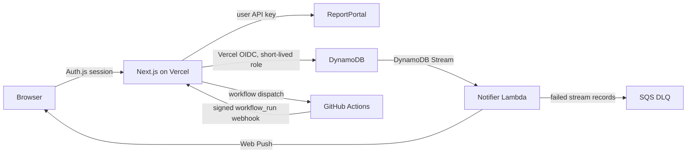

# Engineering guide

## Product boundary

ReportPortal is the source of truth for failure analytics. Failure intelligence normalizes its launches and test history, applies user-configured labels to raw ReportPortal classifications, enriches failures with source links and optional TestRail links, and dispatches selected Cypress specs. It does not copy ReportPortal result history into its application database.

Classification values are not interpreted by built-in project rules. Settings map raw `issue.issueType` or defect-statistic keys to display labels; unmapped values remain visible as returned by ReportPortal. TestRail case links use a user-defined name pattern containing an `{id}` placeholder, so test names do not require a fixed prefix.

Platform preferences are owner-scoped dashboard settings. Selected spec paths copy as a comma-separated list by default; users can switch the clipboard format to one path per line.

Hosted mode is multi-user and authenticated through GitHub. DynamoDB holds only application configuration and run workflow state. Local mode is single-user, unauthenticated, and stores an encrypted envelope in a Docker volume.

## Hosted data flow



The webhook is a Next.js route at the public application URL. A run update written by the webhook reaches the browser through the DynamoDB stream, so the browser does not poll in hosted mode. Returning to a visible tab performs one reconciliation request in case a push was missed.

Local mode keeps a five-second Runs-page refresh because execution occurs in the container and there is no AWS event path.

## DynamoDB model

One Standard-class provisioned table uses `pk` and `sk` string keys, a `NEW_IMAGE` stream, and `expiresAtEpoch` TTL.

| Entity | Partition key | Sort key | Notes |
| --- | --- | --- | --- |
| Dashboard settings | `OWNER#<owner>` | `SETTINGS` | Entire settings document is application-encrypted |
| Cypress profile | `OWNER#<owner>` | `PROFILE#<uuid>` | Name/default metadata is clear; environment is encrypted |
| Cypress run | `OWNER#<owner>` | `RUN#<ISO time>#<uuid>` | Latest 20 are queried in reverse order |
| Run lookup | `RUN_LOOKUP#<uuid>` | `LOOKUP` | Resolves webhook request IDs without a scan |
| Profile snapshot | `SNAPSHOT#<uuid>` | `SNAPSHOT` | Encrypted, one-hour TTL, atomically consumed with delete-and-return |
| Push subscription | `OWNER#<owner>` | `PUSH#<endpoint hash>` | Browser endpoint and public key material; stale endpoints are deleted |

No global secondary index is required. Settings/profile names and run metadata are not treated as credentials. ReportPortal/TestRail keys, profile environment content, and snapshot content are AES-256-GCM encrypted by `src/lib/secure-value.ts` before they leave the server. The owner/record context is authenticated additional data, preventing ciphertext from being moved between users or entity types.

`DATA_ENCRYPTION_KEY` is a server-only Vercel secret. Rotating it requires an application-level re-encryption procedure; replacing it without re-encryption makes encrypted records unreadable.

## Identity and authorization

- Auth.js issues encrypted JWT sessions after GitHub OAuth and organization/user allowlist checks.
- The immutable GitHub numeric user ID forms the owner key that scopes every settings, profile, run, and subscription operation.
- Vercel obtains AWS credentials with its OIDC token. The IAM trust policy matches the Vercel team, project, and production environment exactly.
- The Vercel role can read/write only the application table. No permanent AWS access key is configured.
- GitHub workflow profile delivery validates the short-lived GitHub Actions OIDC identity, repository, workflow, branch, event, and GitHub-hosted runner before consuming a snapshot.
- The GitHub webhook validates its HMAC SHA-256 signature, repository, workflow path, and request UUID before updating a run.

## Web Push

The Runs page registers `public/push-worker.js` and asks the user before requesting notification permission. A subscription is posted through an authenticated route and stored under the user's partition. The public VAPID key is intentionally sent to the browser; the private VAPID key is an SSM Standard SecureString available only to the notifier Lambda.

For each run stream image, the Lambda queries subscriptions for that owner and sends an opaque status message containing the request ID. An open page treats that message only as an invalidation signal and reloads `/api/runs` under the normal Auth.js session. Expired push endpoints are removed. Transient failures use partial batch retry, then the SQS DLQ.

## AWS cost boundary

The CDK templates deliberately provision only:

- one DynamoDB Standard table at fixed 5 RCU / 5 WCU, with no autoscaling, PITR, backups, global replicas, or indexes;
- one 256 MB Lambda invoked by DynamoDB Streams;
- one SQS Standard DLQ;
- one CloudWatch log group with seven-day retention;
- a Vercel OIDC provider and application role, plus a GitHub OIDC provider and deployment role; and
- the CDK bootstrap S3 bucket/assets required by CDK.

This configuration is designed for a low-volume application to stay inside AWS monthly free-tier allowances, but AWS free quotas are shared across the payer account and overage is billable. Infrastructure code cannot guarantee a zero invoice. Configure AWS Budgets/free-tier alerts and monitor the account. S3 bootstrap storage is the acknowledged exception and may be billable depending on account eligibility and aggregate usage.

## Important modules

| Path | Responsibility |
| --- | --- |
| `src/lib/reportportal.ts` | ReportPortal pagination, launches, items, and history contracts |
| `src/lib/analytics.ts` | Failure identity, history, risk, and aggregate calculations |
| `src/lib/user-settings.ts` | Settings, profiles, encryption boundary, and one-time snapshots |
| `src/lib/cypress-run-store.ts` | Hosted DynamoDB/local volume run repository |
| `src/lib/test-runners` | Provider-neutral runner contract, registry, and provider adapters |
| `src/lib/domain-constants.ts` | Shared domain, protocol, storage, validation, and time constants |
| `src/lib/authenticated-encryption.ts` | Shared AES-256-GCM authenticated-encryption primitive |
| `src/lib/dynamodb.ts` | DynamoDB client and Vercel OIDC credential provider |
| `src/lib/secure-value.ts` | Hosted AES-256-GCM value encryption |
| `src/app/api/webhooks/github/route.ts` | Signed GitHub workflow webhook |
| `infra/functions/push-notifier.ts` | Stream-to-Web-Push notification Lambda |
| `infra/lib` | CDK storage, notifier, Vercel runtime IAM, and GitHub deployment IAM stacks |
| `src/lib/local-store.ts` | Encrypted local Docker persistence |
| `src/lib/local-cypress-runner.ts` | In-container repository and Cypress execution |

## Environment variables

Hosted runtime:

| Variable | Secret | Purpose |
| --- | --- | --- |
| `APP_MODE=hosted` | No | Enables authenticated hosted behavior |
| `APP_BASE_URL` | No | Canonical application origin outside Vercel; Vercel supplies its production URL automatically |
| `AUTH_SECRET` | Yes | Auth.js encryption/signing secret |
| `AUTH_GITHUB_ID` / `AUTH_GITHUB_SECRET` | Yes | GitHub OAuth App |
| `AUTHORIZATION_MODE`, allowlist | No | Organization or explicit-user admission |
| `AWS_REGION` | No | DynamoDB region |
| `AWS_DYNAMODB_TABLE` | No | CDK-created table name |
| `AWS_ROLE_ARN` | No | Vercel OIDC-assumable application role |
| `DATA_ENCRYPTION_KEY` | Yes | Application-level record encryption, minimum 32 characters |
| `WEB_PUSH_PUBLIC_KEY` | No | VAPID public key |

ReportPortal, TestRail, GitHub Actions, GitHub source, webhook, and Cypress-profile settings are owner-scoped application integrations. Their secrets are encrypted before persistence and are never deployment environment variables or returned to the browser.

CDK deployment variables are documented in `docs/AWS_INFRASTRUCTURE.md`. Local Docker variables and persistence are documented in `docs/LOCAL_DOCKER.md`.

## Verification

Run:

```bash
pnpm check
pnpm infra:synth
```

Tests should prioritize ReportPortal response contracts, owner isolation, encrypted repository round trips, snapshot single-consumption behavior, webhook filtering/signatures, DynamoDB stream retry behavior, and browser service-worker states. Never log decrypted integration/profile values, OAuth tokens, AWS role credentials, webhook secrets, or notification private keys.
