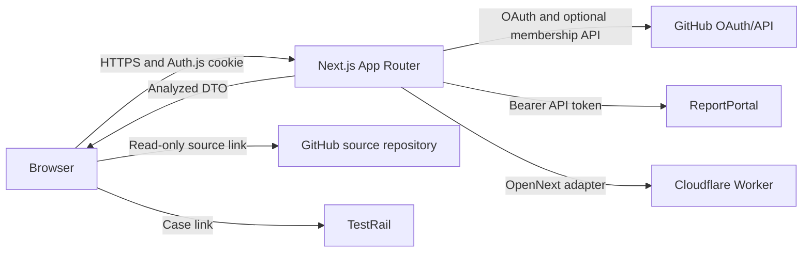
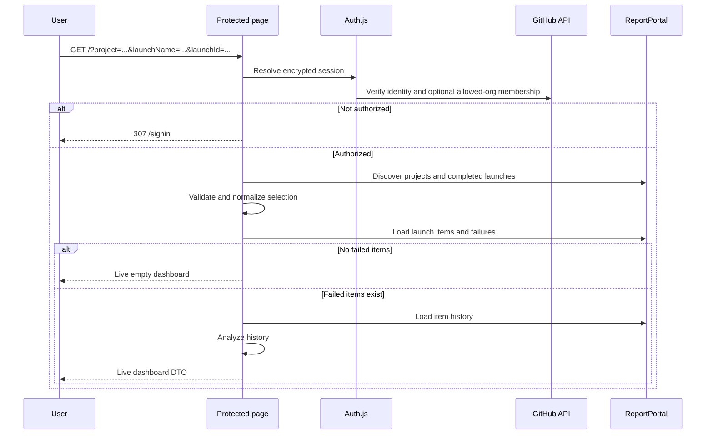

# Failure Intelligence Engineering Guide

## Purpose

Failure Intelligence is an authenticated, read-only analytics application for investigating failed automated tests stored in ReportPortal. It helps an authorized user select a ReportPortal project, launch name, specific completed run, team, and history depth; inspect failure patterns; and open the corresponding Cypress source, ReportPortal log, or TestRail case.

ReportPortal is the source of truth. The application has no database and contains no bundled report or fallback test data.

## Product Boundaries

The application:

- Reads projects, launches, test items, and item history from ReportPortal.
- Calculates failure metrics and risk categories in memory for each request.
- Authenticates users with GitHub OAuth and restricts access by active organization membership or a static GitHub-login allowlist.
- Creates read-only links to a configured GitHub source repository.
- Optionally creates TestRail links from test case identifiers.
- Dispatches explicitly selected Cypress specs to a bounded GitHub Actions workflow.
- Deploys as a Next.js application through OpenNext on Cloudflare Workers.

The application does not:

- Run Cypress tests inside the dashboard or Vercel runtime.
- Modify the configured source repository.
- Store reports, user profiles, or credentials in an application database.
- Show bundled, synthetic, cached, or cross-launch fallback report data.
- Allow unauthenticated local development access.

## Primary Use Cases

### Investigate a failed launch

1. Sign in with GitHub.
2. Select an accessible ReportPortal project.
3. Select a completed launch name.
4. Keep the latest completed run selected or choose a historical run. Historical selections display a warning.
5. Enter the team filter and choose a history depth.
6. Review current failures, historical failure rate, streaks, transitions, and risk categories.
7. Open the source spec, ReportPortal log, or TestRail case.

### Share a report selection

The project, launch name, launch ID, team, and history depth are encoded as validated URL query parameters. An authorized colleague can open the URL and reproduce the exact run selection. Authentication is still required.

### Handle an empty result

A valid ReportPortal response with no matching tests or failures is not an error. Metrics remain zero and the grid displays `No data`.

### Handle an integration failure

A ReportPortal transport or API failure produces no report rows. The UI displays an error toast and marks the source as a load error. It never substitutes another project, team, or launch.

## System Architecture



### Runtime layers

| Layer | Ownership | Responsibilities |
| --- | --- | --- |
| `src/app` | Routing and server composition | Authentication boundary, query validation, redirects, Auth.js endpoints, page metadata |
| `src/auth.ts` | Identity and authorization | GitHub OAuth, mode-specific authorization, JWT/session shaping |
| `src/lib/config.ts` | Configuration boundary | Server-side environment validation and normalized configuration |
| `src/lib/reportportal.ts` | Integration boundary | ReportPortal discovery, launch resolution, item/history loading, explicit empty/error outcomes |
| `src/lib/cypress-runs.ts` | Execution boundary | Authenticated GitHub Actions workflow dispatch |
| `src/lib/cypress-run-request.ts` | Validation boundary | Selected spec paths and bounded runner settings |
| `src/lib/analytics.ts` | Domain logic | Convert ReportPortal history into rows, trends, metrics, and risk categories |
| `src/lib/types.ts` | Internal contracts | Dashboard DTOs, ReportPortal response shapes, report selection types |
| `src/components/Dashboard.tsx` | Client UI | Selectors, filters, DataGrid, links, metrics, empty states, and error toasts |
| `src/types` | Framework augmentation | Auth.js session and JWT type extensions |

### Request flow



## Authentication and Authorization

Authentication is mandatory in every environment, including local development.

1. Auth.js redirects the user to GitHub OAuth with identity scopes; `read:org` is added only in organization mode.
2. `AUTHORIZATION_MODE` selects `organization` or `users`; configuration validation requires a non-empty allowlist for the selected mode.
3. In `organization` mode, GitHub must report `state: active` for the user in an organization in `AUTH_ALLOWED_ORGS`. The app requests `read:org`, retains the token only in the encrypted HTTP-only JWT, and revalidates membership on protected requests.
4. In `users` mode, the authenticated GitHub login must match an entry in `AUTH_ALLOWED_USERS`, case-insensitively. The app does not request `read:org` or retain the OAuth access token.
5. Every protected request revalidates the current identity against the active mode and deployment configuration.
6. The browser-visible session contains display identity and a non-secret authorization context, but never the GitHub access token.

There is no local bypass flag. Missing OAuth configuration fails application configuration validation.

### Local OAuth configuration

The default development origin is `http://localhost:8080`.

Create a GitHub OAuth App with:

- Homepage URL: `http://localhost:8080`
- Authorization callback URL: `http://localhost:8080/api/auth/callback/github`

Use `localhost`, not `127.0.0.1`, because GitHub callback URLs must match exactly. Never commit the OAuth client secret or Auth.js secret.

## Data Model and Analytics

### Selection

A report selection contains:

- `project`: ReportPortal project name.
- `launchName`: exact completed launch name.
- `launchId`: exact completed run ID. When omitted or invalid for the launch name, the latest completed run is selected and the URL is canonicalized.
- `team`: substring used to filter ReportPortal item names.
- `historyDepth`: number of historical launches, constrained to 1 through 30 by the ReportPortal API.

Projects, launch names, and completed runs are discovered server-side. Changing project or launch name defaults to its latest completed run. Selecting an older run preserves its ID in the URL and displays a warning that the analysis is historical.

### Metrics

The dashboard currently calculates:

- Current suite failure rate.
- Number of failed test identities and unique Cypress specs.
- Historical cohort failure percentage.
- Immediate regressions, where the current failure follows a passed execution.
- Current failure streak and status transitions per test.
- Risk distribution.

Risk categories are derived from returned history:

- `Persistent`: failed in every returned execution.
- `High risk`: at least eight failed executions, but not every execution.
- `Isolated`: exactly one failed execution.
- `Intermittent`: any remaining failure pattern.

These categories are application analytics, not ReportPortal defect types.

### Source links

The GitHub source URL is assembled from deployment-fixed owner, repository, and ref plus the ReportPortal `codeRef`-derived Cypress path. Browser input cannot choose a repository or ref. The integration is link-only and has no GitHub repository token or write operation.

## Error and Empty-State Contract

Keep these outcomes distinct:

| Outcome | `meta.source` | Rows | User feedback |
| --- | --- | --- | --- |
| Successful data | `live` | Returned failures | Live data indicator |
| Successful empty response | `live` | Empty | `No data` in the grid |
| API/configuration failure | `error` | Empty | Error toast and load-error indicator |

Do not catch an integration failure and return data from another selection. Do not add fixtures to production loader paths. Test fixtures, when introduced, must remain isolated to tests.

## Configuration

All secrets are server-only. No secret may use a `NEXT_PUBLIC_` prefix.

| Variable | Required | Secret | Purpose |
| --- | --- | --- | --- |
| `APP_NAME` | No | No | Display name |
| `AUTH_SECRET` | Yes | Yes | Auth.js JWT/cookie encryption |
| `AUTH_GITHUB_ID` | Yes | No | GitHub OAuth client ID |
| `AUTH_GITHUB_SECRET` | Yes | Yes | GitHub OAuth client secret |
| `AUTHORIZATION_MODE` | No | No | `organization` (default) or `users` |
| `AUTH_ALLOWED_ORGS` | In organization mode | No | Comma-separated GitHub organization allowlist |
| `AUTH_ALLOWED_USERS` | In users mode | No | Comma-separated GitHub-login allowlist |
| `GITHUB_ACTIONS_TOKEN` | For Cypress dispatch | Yes | Fine-grained token with Actions write access to the dashboard repository |
| `GITHUB_ACTIONS_OWNER` | No | No | Workflow repository owner |
| `GITHUB_ACTIONS_REPO` | No | No | Workflow repository name |
| `GITHUB_ACTIONS_WORKFLOW` | No | No | Selected-spec workflow filename |
| `GITHUB_ACTIONS_REF` | No | No | Workflow ref |
| `AUTH_TRUST_HOST` | Deployment-dependent | No | Auth.js trusted-host behavior |
| `RP_API_URL` | For live data | No | ReportPortal API v1 base URL |
| `RP_API_KEY` | For live data | Yes | Read-only ReportPortal API token |
| `GITHUB_SOURCE_OWNER` | Yes | No | Source link repository owner |
| `GITHUB_SOURCE_REPO` | Yes | No | Source link repository name |
| `GITHUB_SOURCE_REF` | Yes | No | Fixed source link branch, tag, or SHA |
| `TESTRAIL_BASE_URL` | No | No | Base URL for TestRail case links |

Some legacy integration variables may remain in local environments, but application code must not imply support unless the variable is validated and consumed by `src/lib/config.ts`.

## Local Development

Requirements:

- A supported Node.js version for Next.js 16.
- Corepack and pnpm 10.15.1.
- A local GitHub OAuth App configured for port 8080.
- Membership in an allowed organization or a login in the configured static-user allowlist.
- ReportPortal credentials for live reports.

```bash
corepack enable
pnpm install
cp .env.example .env.local
pnpm exec auth secret
pnpm dev
```

Open `http://localhost:8080`. The package script owns the default host and port:

```json
"dev": "next dev --hostname localhost --port 8080"
```

Override the script explicitly only for a deliberate alternate OAuth App configuration. The OAuth callback must use the same origin as the running app.

## Code Guidelines

### General

- Use TypeScript and preserve strict internal contracts.
- Keep server credentials and third-party API calls in server-only modules.
- Validate all URL and environment input with Zod at a server boundary.
- Prefer small, explicit functions over speculative abstractions.
- Keep changes scoped to the owning layer.
- Do not add repository mutation or test-execution behavior without an explicit architecture decision.
- Use pnpm exclusively for this application.

### Next.js and React

- Read the versioned Next.js documentation in `node_modules/next/dist/docs/` before relying on framework behavior.
- Prefer Server Components for authentication, integration calls, and initial data loading.
- Add `"use client"` only where browser state or interactions require it.
- Keep protected data access behind `getAuthorizedSession()`; hiding controls in the browser is not authorization.
- Preserve URL-backed report selection so reports remain reproducible and shareable.
- Avoid exposing server error internals beyond actionable, non-secret messages.

### ReportPortal integration

- Add endpoints through the server-only ReportPortal client.
- Use structured URL/query APIs rather than string concatenation.
- Treat non-2xx responses as errors and retain endpoint/status context.
- Distinguish an empty successful response from a failed request.
- Fetch history only when current failed items exist.
- Never substitute fixture or previous-launch data after a live failure.
- Consider pagination whenever an endpoint can exceed its requested page size.

### UI

- Follow the established MUI theme and compact operational layout.
- Use selectors for finite server-discovered choices.
- Use toasts for integration failures and `No data` for valid empty results.
- Keep source, ReportPortal, and TestRail links visibly distinct and read-only.
- Ensure controls and DataGrid remain usable on mobile and desktop widths.

### Security

- Never log, serialize, or expose OAuth, ReportPortal, Jira, or TestRail secrets.
- Never route credentials through client props or browser storage.
- Validate selected specs as repository-relative Cypress paths and bound spec count, repetitions, threads, browser, and timeout before dispatch.
- Keep `GITHUB_ACTIONS_TOKEN` server-only and keep the Base64-encoded Cypress environment in the GitHub repository secret `STRIPES_TESTING_ENVIRONMENTS_B64`.
- Keep GitHub source repository configuration server-controlled.
- Maintain fail-closed authorization when the selected organization or user authorization rule cannot be verified.
- Do not add an authentication bypass for development or tests.
- Use isolated test doubles at test boundaries when authentication needs automation.

## Validation and Testing

Run the complete repository check before merging:

```bash
pnpm check
```

It currently runs ESLint, legacy script syntax checks, and a production Next.js build.

For behavior changes, also validate the smallest relevant path:

- Authentication: unauthenticated `/` redirects to `/signin`; OAuth uses the 8080 callback; logins outside the active mode's allowlist are rejected.
- Report selection: changing project or launch name refreshes completed run choices and canonicalizes to the latest run; selecting an older run preserves its launch ID and displays a warning.
- Live data: failures produce rows and metrics from the selected launch/team only.
- Empty data: a valid empty response shows `No data` and no error toast.
- Error data: an API failure shows an error toast and no rows.
- Source links: generated URLs use the configured owner, repository, and ref.

Automated tests are not yet established. New tests should prioritize pure analytics unit tests, ReportPortal client contract tests with mocked fetch responses, auth callback tests, and browser tests for the states above.

## Deployment

Production deployment uses OpenNext and Cloudflare Workers:

1. Configure a production GitHub OAuth App with the deployed HTTPS origin and callback.
2. Store authentication and ReportPortal secrets with Wrangler secrets.
3. Configure non-secret variables in Worker configuration or deployment environment.
4. Run `pnpm check`.
5. Run `pnpm deploy`.
6. Verify sign-in, organization rejection, ReportPortal access, empty/error states, and source links in the deployed environment.

Cloudflare does not provide an application database for this project because none is required. Auth.js uses encrypted JWT sessions.

## Known Limitations and Next Work

Current known limitations:

- Team is currently free text rather than a server-discovered selection.
- ReportPortal page traversal is not yet generalized across all endpoints.
- Automated tests are not yet present.
- The dashboard component contains several compact inline render blocks that may merit extraction as behavior grows.

Recommended order of work:

1. Discover valid teams for the selected launch and replace the team text field with a selection.
2. Implement complete pagination for discovery, items, failures, and history.
3. Add focused automated tests for authentication, integration outcomes, and analytics.
4. Validate and deploy through Cloudflare Workers.

## Architecture Decision Checklist

Before adding a feature, verify:

- Does it preserve mandatory GitHub authorization?
- Does it keep secrets server-side?
- Is ReportPortal still the source of truth?
- Does it avoid writing to or executing code in the source repository?
- Are empty and error outcomes represented honestly?
- Is user input validated at the server boundary?
- Does it require persistence, and if so, has that new system boundary been explicitly designed?
- Is the behavior covered by a focused executable check?
